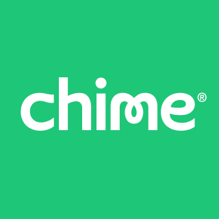

# Chime

## Creating financial peace of mind 
##

Chime serves as a digital banking system where two banks (Bancorp Bank and Stride) have partnered to service customers strictly through the web. This company was founded in 2013 in San Francisco, CA, by Chris Britt, Ryan King, and Chris King. Chime is a financial technology company that provides non-traditional financial services such as getting direct deposits early and providing services with zero fees. As with Chime, it is funded by investors, some of whom include Vantage Legacy Capital and General Atantlic, and has raised approximately $25 billion in funds. The founders of Chime believe in creating financial peace of mind, which is why they created this financial technology company, providing a stress-free service that is inclusive for all people.

Chime is a neobank; it does not have the same support as traditional banks.
 Many people are experiencing fraud and technology issues and cannot access their accounts, harming the reputation of the company itself and the consumers of this product. Many consumers have complained about the company's dispute resolution practices, as they are experiencing hardships attempting to get a resolution. In most cases, this leads to account closure and complete money loss.
  This fintech company targets people with lower incomes, ranging from $60,000 or lower. People use this digital bank as a replacement for traditional banks; in most cases, they are not qualified for a second chance account. There will be approximately 21.6 million users in 2023, according to Priori Data. As a solution to the fraud that has been going on, Chime introduced a policy called the Visa Zero Liability Policy to ensure that customers will not be held responsible for unauthorized transactions. Chime also supports two-factor authentication and fingerprint authentication. This company uses various applications and systems to sell, build, and market their products. These applications consist of, but are not limited to, Github for development, Pandas for libraries, AWS for hosting,and Snowflake for data storage.

Chime is considered one of the top fintech companies in digital banking.
Cloud computing has been one of the best innovations that digital banks are implementing. This allows banks to be more cost-efficient by reducing data storage costs by not paying all at once for the applications. Another trend commonly used by many other businesses is enhancing the customer experience by including chatbots, mobile apps, and 24/7 customer support access. Banks are also investing in data analytics to get insight on customer preferences. Similarly, companies that support digital banking are Ally, Current, and Varo, which could be alternatives for Chime.

Chime has the highest checking account share. "Chime has a 35% share of all digital bank checking accounts. The next biggest competitors are Ally Bank with 9% of the digital banking market and Varo Money with a 6% share" (Forbes 1). This fintech company has increased its value through its marketing tactics and features. Spot Me is one of the features that allows you to make purchases that will overdraw the account with no fees. Digital banking companies measure success by calculating the customer lifetime value, lead-to-sales ratio, and retention by checking how many times you log in to the app per week. Chime is one of the leading fintech companies in digital banking; its customer value is roughly $300 and $30 billion in transactions.

If an international payment system were to be installed to replace wiring money internationally at a lower cost, I believe the users and demographics of the people who use this application would change drastically. Additionally, this would benefit the company by making more money on a new service, expanding the demographics of the company, and making the company global. A Swift network will be needed to complete international transactions. A Swift code is a format so the business or bank can be identified along with the account number when transferring money internationally.

* https://www.forbes.com/sites/ronshevlin/2020/11/16/how-14-billion-chime-is-dominating-digital-banking-and-all-of-banking/?sh=5258af6a2210

* https://www.chime.com/security-and-control/#:~:text=Chime%20debit%20cards%20are%20protected,authentication%20and%20support%20fingerprint%20authentication.

* https://www.crunchbase.com/organization/chime-2/company_financials
* https://www.forbes.com/advisor/banking/chime-review/
* https://himalayas.app/companies/chime/tech-stack
* https://www.linkedin.com/pulse7-digital-banking-trends-look-out-2023-ndctech/
* https://www.forbes.com/sites/jeffkauflin/2019/11/18/digital-bank-chime-will-quadruple-its-revenue-in-2019-reeling-in-direct-deposits/?sh=2348acf66487